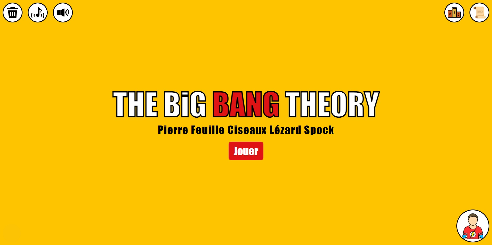
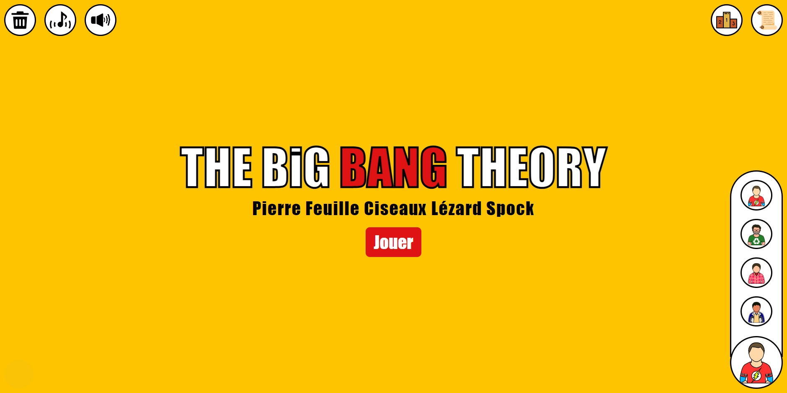
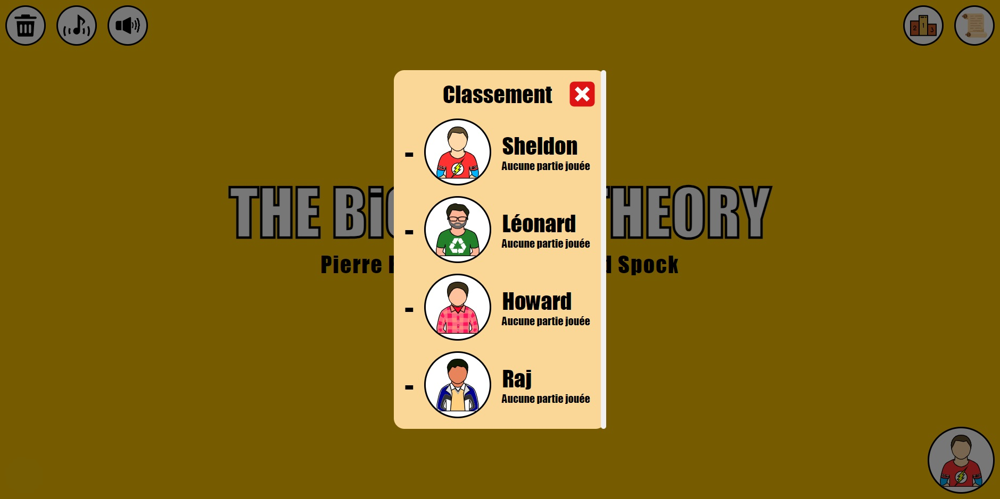
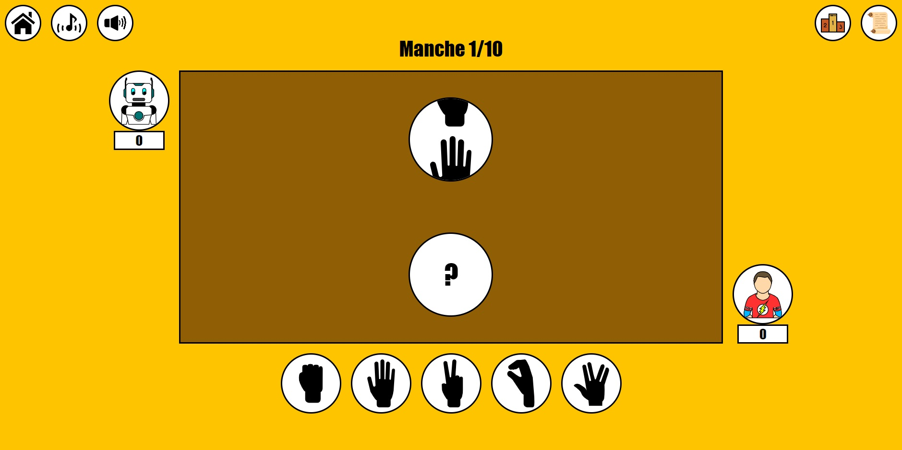

# PFCLS

The Rock-Paper-Scissors-Lizard-Spock game from the series "The Big Bang Theory" made in a website. This site allowed me to use the storage method named "local storage" and to practice Javascript.
## Features
- Rules of the game
- Various playable characters from the series
- Characters ranking
- Game save
- Background music and sounds
- IA who changes heads depending on whether she wins or not
## Installation
1. Download the repository by clicking on `Code > Download ZIP`
2. Extract the ZIP file
3. Move the resulting files at the root of your website
## Usage
Once you have installed the project, you can open it by opening your website url in your browser.

You can choice a character by clicking on the character icon in the bottom right corner.

You can see the ranking by clicking on the ranking icon in the top right corner.

You can play to the game by clicking on `Jouer` in the center of the screen. Then you will see the game screen.

